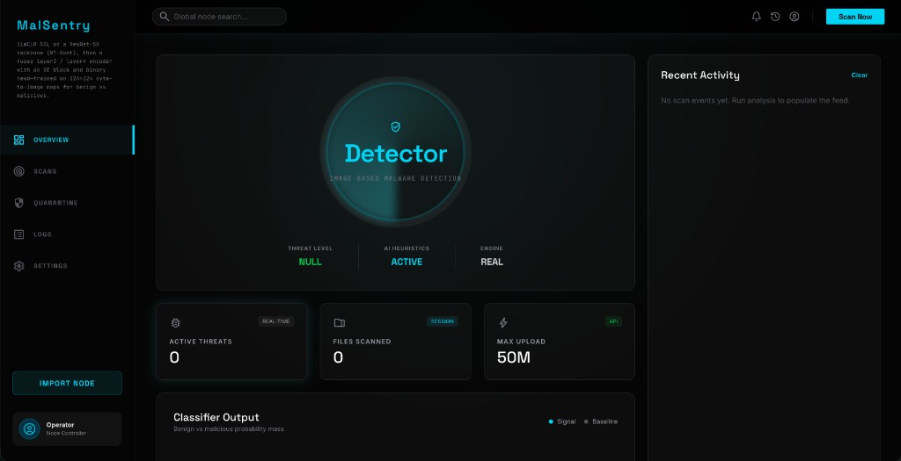
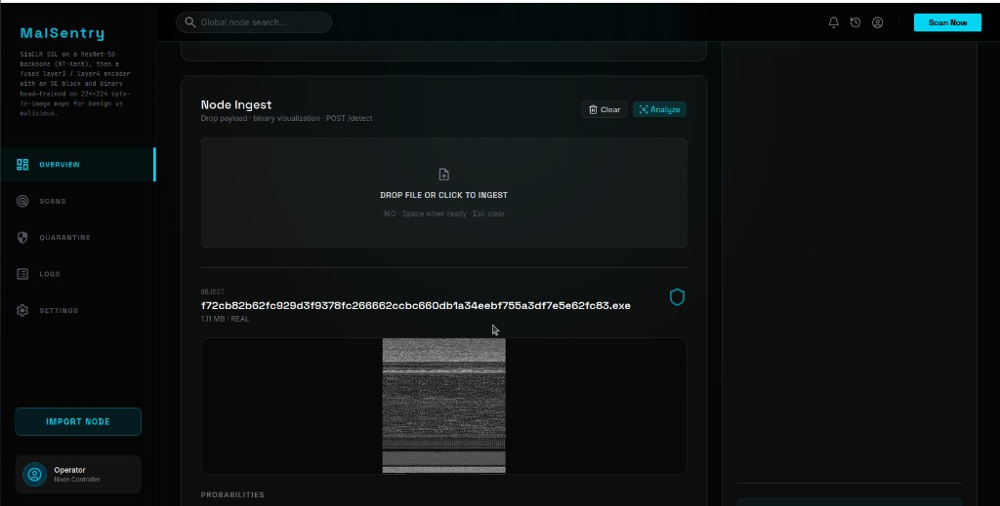
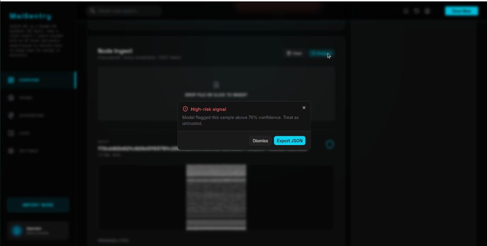

# MalSentry

**MalSentry** is an image-based malware analysis lab: arbitrary files are converted to a 2D byte visualization, then classified by a **self-supervised (SimCLR) ResNet-50** stack with **multi-scale fusion** and an **SE** attention block. A **React + Vite** dashboard (**MalSentry** shell) talks to a **Flask** API for upload, visualization, and detection.

---

## Screenshots

### Dashboard overview



### Node ingest — binary map and analysis



### High-risk alert



---

## Overview

| Layer | Role |
|--------|------|
| **Browser** | MalSentry UI: drag-and-drop ingest, pipeline status, probability charts, recent activity, optional high-risk dialog and JSON export. |
| **Flask** | Serves the built SPA, `POST /upload` (multipart file → PNG + `file_id`), `POST /detect` (`{"file_id": "..."}`), `GET /health`, static uploads. |
| **Model** | ResNet-50 encoder, fused layer3/layer4 features, SE block, single logit + **sigmoid** (BCE-style training: malicious ↔ label 1). |
| **Conversion** | Bytes → RGB image for model input (see `utils/conversion.py`). |

**Important:** Detection always uses **`file_id`** from a successful upload — the client never sends raw image bytes to `/detect`.

---

## Model (SSL stack)

Training follows a **SimCLR → fine-tune** recipe (see your notebook, e.g. `malware-f30-u20-70.ipynb`):

1. **Phase 1 — SimCLR**  
   ResNet-50 trunk (global pooling head removed), **NT-Xent** contrastive loss, projection head for views of the same image.

2. **Phase 2 — Classifier**  
   Same backbone split into `stem` + `layer1`–`layer4`, **1×1** reductions on C3/C4, **upsample + concat**, **SE** on fused channels, **GAP**, MLP head **→ 1 logit** (binary BCEWithLogitsLoss in training).

3. **Inference**  
   `P(malicious) = sigmoid(logit)`; benign / malicious bars and class label derive from that (ImageFolder order: Benign = 0, Malicious = 1).

Weights are expected as a **`torch.save(classifier.state_dict(), …)`** checkpoint (e.g. `final_model.pth`). Place the file under `models/` or set `MALWARE_MODEL_NAME`.

---

## API

| Method | Path | Description |
|--------|------|-------------|
| `GET` | `/` | Single-page app (production build from `static/spa/`). |
| `GET` | `/health` | `model_loaded`, `model_type`, `max_upload_size_mb`. |
| `POST` | `/upload` | Form field `file` → JSON with `file_id`, `image_base64`, `filename`, etc. |
| `POST` | `/detect` | JSON `{"file_id": "<hex>"}` → prediction + probabilities. |
| `GET` | `/static/uploads/<name>` | Saved visualization PNGs. |

---

## Repository layout

```
MalSentry/
├── app.py                 # Flask app, model load, routes
├── requirements.txt
├── models/                # Put *.pth here (gitignored by default)
├── static/spa/            # Vite production build (committed for easy run)
├── frontend/              # React + Tailwind + shadcn + GSAP source
├── utils/
│   ├── malware_model.py   # Architecture + load + predict_pil
│   ├── inference.py       # Paths / re-exports
│   └── conversion.py      # File → image
└── docs/screenshots/      # README images
```

---

## Quick start

### 1. Python environment

```bash
cd MalSentry
python -m venv .venv
source .venv/bin/activate   # Windows: .venv\Scripts\activate
pip install -r requirements.txt
```

### 2. Model weights

Copy your exported checkpoint into `models/`, for example:

- Default expected name: **`models/final_model.pth`**
- Or: `export MALWARE_MODEL_NAME=your_weights.pth` before starting the server.

Without a valid checkpoint the app runs in **simulation** mode (no real scores).

### 3. Run the server

```bash
python app.py
```

Default URL: **http://127.0.0.1:5002/**

### 4. Frontend development (optional)

```bash
cd frontend
npm install
npm run dev          # proxies API to Flask :5002
npm run build        # outputs to ../static/spa
```

---

## Environment

| Variable | Meaning |
|----------|---------|
| `MALWARE_MODEL_NAME` | Filename under `models/` (default `final_model.pth`). |

---

## Tech stack

- **Backend:** Python 3, Flask, PyTorch, torchvision, Pillow, Gunicorn-ready.
- **Frontend:** React 19, TypeScript, Vite, Tailwind CSS v4, shadcn/ui, GSAP, Recharts, Sonner.

---

## Security note

This tool is for **research and authorized analysis** only. Do not run unknown malware on production systems without isolation. High-confidence alerts are **heuristic** — validate with additional tooling and process.

---

## License

Specify your license in a `LICENSE` file if you publish the repository publicly.

---

## Author

Repository: **https://github.com/hasan-sakib/MalSentry**
